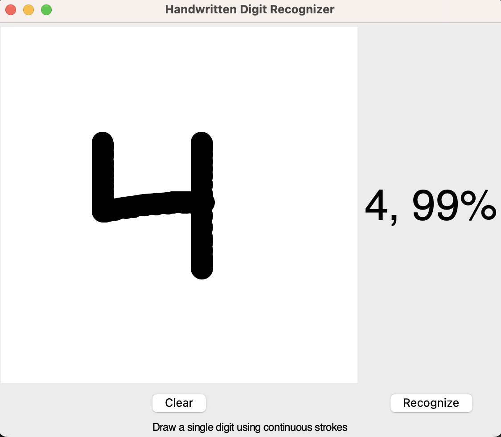

# Handwritten Digit Recognizer

A Python application that recognizes handwritten digits using a Convolutional Neural Network (CNN) trained on the MNIST dataset. The application provides a user-friendly GUI where users can draw digits and get real-time predictions.

## Features
- Real-time digit recognition with confidence scores
- Smart input validation (rejects non-digit patterns)
- Smooth drawing interface with optimized brush size
- Cross-platform GUI using Tkinter
- ~99% accuracy on MNIST test set

## Installation
### Dependencies
- TensorFlow 2.x
- NumPy
- Pillow (PIL)
- Tkinter

Install required packages (either method):
```bash
# Method 1: Install packages individually
pip install tensorflow pillow numpy

# Method 2: Using requirements.txt
pip install -r requirements.txt
```

Ensure Tkinter is installed:
- **Windows/Linux**: Tkinter comes with Python
- **macOS**: Install via Homebrew:
  ```bash
  brew install python-tk
  ```

## Usage
1. Optional: Train the model (skip if using pre-trained model):
```bash
python train_model.py
```

2. Launch the application:
```bash
python digit_recognizer.py
```

3. Draw a digit and click "Recognize" (or "Clear" to reset)

## Drawing Tips
- Draw digits that fill most of the canvas height
- Use continuous strokes
- Center the digit in the canvas
- Draw clear, well-formed digits
- Avoid decorative or stylized numbers

## Project Files
- `digit_recognizer.py`: Main GUI application
- `train_model.py`: Model training script
- `mnist.h5`: Trained model weights
- `requirements.txt`: Package dependencies

## User Interface

